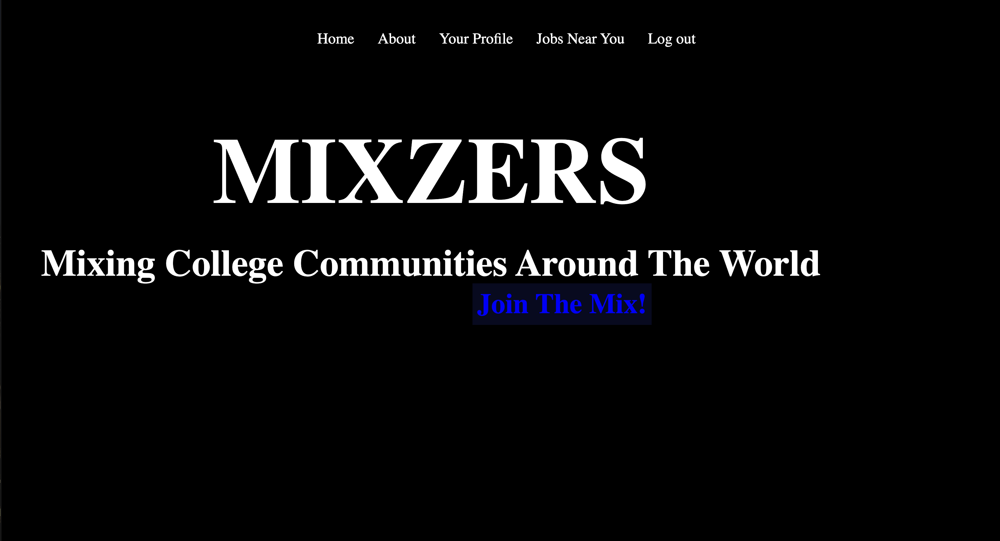
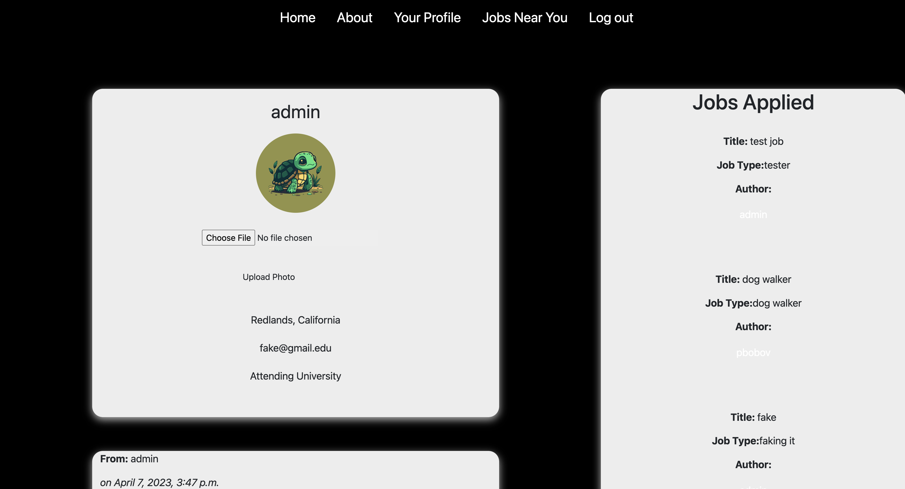

# MixZers

A full-stack Django application designed to offer college students the opportunity to find work and make money without committing to a full-time or corporate job, all while bringing communities together as they support college students.

As college students ourselves, we have been in situations where we need/want to make money but our academic and extracurricular schedules don't allow us to, the traditional way due to time contraints. This app serves to remedy this situation no matter where we are in the country nor whether we will be traveling to other locations outside of our college towns.

An unforseen benefit to our app, is it allows communities across the country to 'Mix' given that students travel --between their hometowns and collegetowns (at least)-- and they will be working in both of those locations. Interacting with other communities outside of their own broadens students' perspectives on life and understanding --which we think is cool!

# Screenshot

# Technologies Used

- Python
- HTML
- CSS
- PostGreSQL Database
- Django
- Google's GeoCoding API
- Bootstrap Framework
- PostGIS

# Getting Started

##If you're interested in our workflow:
###...here is our trello that set the stage for planning and organization
[Click Here!](https://trello.com/invite/b/RRmfgLZU/ATTIa18c6aa247cea7b2dc4584bdfa53809d9A07AD3F/icebox-details)

##If you're interested in our original pitch deck:
[Click Here!](https://docs.google.com/presentation/d/1xAcNij7FQ59HF7Wo0hH3teuVAM_x9xToG41AhyoQaho/edit?usp=sharing)

##Link to our live site:
[MixZers Application](https://mixzers.herokuapp.com/)

# Next Steps

- We'd like to see our site refine it's messaging functionality and make it's UI/UX more user friendly
- We'll be working harder toward mobile-responsive design --as we know that students use most applications on their phones
